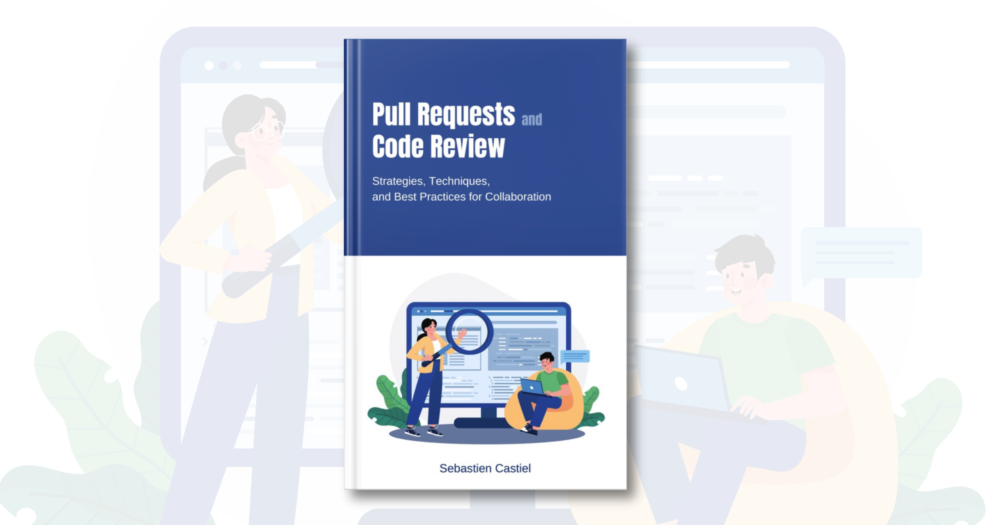

# Pull Requests and Code Review

**Strategies, Techniques,and Best Practices for Collaboration**

This is a book where I listed all the advice I gave to and received from developers over the past few years about pull requests and code review. You’ll find real-life examples and actionable insights to get better at the exercise, a must for everyday developer collaboration.

Here are the available options to read the book:

- In the file [manuscript.md](manuscript.md), you’ll find the book’s full content as Markdown.

- You can find the PDF and ePub versions on [Gumroad](https://scastiel.gumroad.com/l/pull-requests-code-review) (pay what you want, starting from $0) or [Amazon](https://kdp.amazon.com/amazon-dp-action/us/dualbookshelf.marketplacelink/B0CKWSJ4NL) ($2.99).

As a bonus, you’ll find on the repository all that is necessary to build the PDF and ePub versions book using [Pandoc](https://pandoc.org). Feel free to reuse it or use it for inspiration to distribute your own book!

## License

[Pull Requests and Code Review](https://scastiel.dev/pull-requests-code-review) © 2023 by Sebastien Castiel is licensed under [Attribution-NonCommercial-NoDerivatives 4.0 International](http://creativecommons.org/licenses/by-nc-nd/4.0/?ref=chooser-v1)
