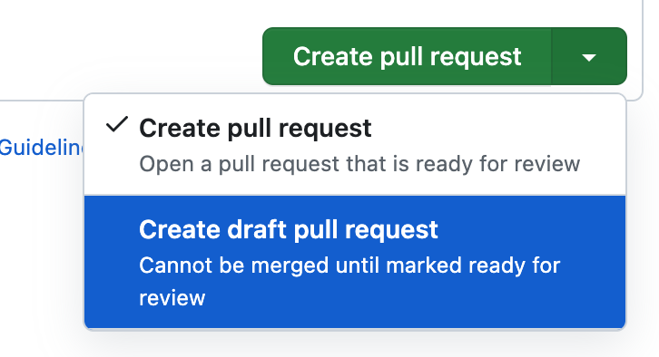
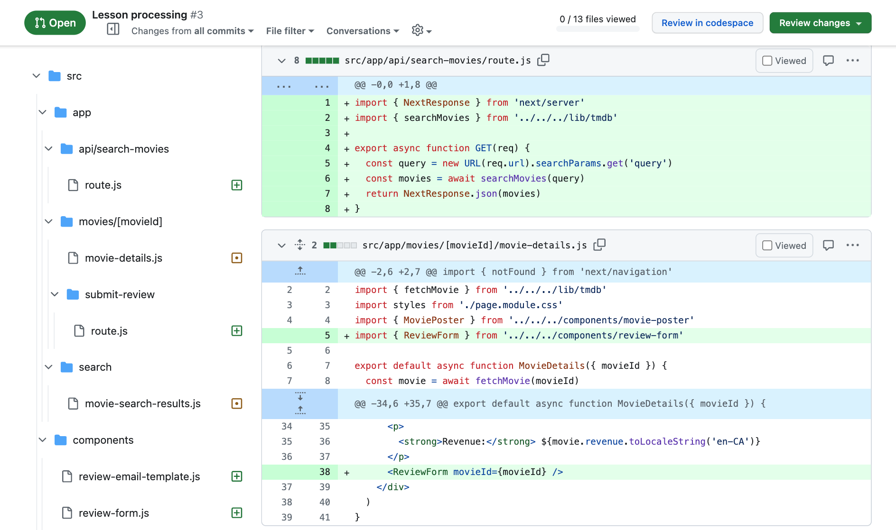

# Introduction {-}

Pull requests have become an essential part of the developer workflow over the past decades. They are widely recognized as an efficient way to encourage collaboration on code and improve code quality in the long term.

However, pull requests are sometimes only seen as a technical tool to prevent the introduction of bad code into the application. In my opinion, they are much more than that. They serve as a primary communication tool for developers, especially now that many developers work remotely.

Pull requests, or PRs for short, allow developers to request code reviews, discuss code changes, update teammates on their progress, and suggest alternative approaches to implementing features.

Their importance is such that many teams have specific guidelines for the size of a pull request, the information that should be included in its description, and the number of reviewers assigned, among other considerations.

Despite their significance, working with pull requests is not always easy. It can take a long time to receive a review, and even more for an approval. Additionally, miscommunication issues may arise if the right tone is not used in comments.

This guide will help you create better pull requests (chapters 1 to 6) and increase your chances of receiving relevant reviews. It will also provide advice on conducting effective code reviews (chapters 7 to 13) and optimizing communication between you and your teammates.

By following this guide, you will have the tools to become the person in your team who is known for submitting pull requests that are pleasant to review and providing meaningful feedback when assigned to review others' code.

# Create your PR before the code is ready for review

When learning about how pull requests work, it is commonly understood that you should create one when your code is ready for review by your peers. However, it is actually beneficial to create a pull request earlier, even right after you start working on your feature. This practice can be helpful for both you and your team.

Once you have written some code for your feature, you can create the pull request as a _draft_. This means that the pull request will be visible to other developers on your team, but they will know that it is not yet ready for review.



What is the point of creating the PR before it is ready? There are several benefits to doing so.

## Review your changes from outside of your IDE {-}

Once your PR is created, you can view all the code changes on GitHub. This offers a different experience compared to reviewing changes in your VS Code. You may identify certain issues or areas for improvement that are more challenging to identify when reviewing the entire project.



You will also see your changes in the same way as your peers will see them when reviewing your pull request. This is a good first step to be the first reviewer of your PR! See [3. Be your PR’s first reviewer](#be-your-prs-first-reviewer).

## Document your progress {-}

When working on a feature for multiple days, it's important to keep your team informed about your progress. One effective way to document it is by using the PR description.

You may already be familiar with the practice of sharing your accomplishments, current tasks, and any obstacles you're facing during daily standup meetings. Why not apply a similar approach to populate your PR's description?

To make it more visual and easy to understand, you can utilize Markdown's checkbox feature to indicate what you have already completed and what tasks are still pending:

```markdown
**Done**

- [x] Create the UI component for the search feature
- [x] Create unit tests for the component

**To do**

- [ ] Add the component to the app header
- [ ] Update end to end tests

**Blockers**

- Still not sure why the end to end tests fail some time on the app header
```

Make sure to include the necessary context elements in the description so that your team can understand your PR. You don't have to provide a complete description as if the pull request is ready, but at least give a brief summary of what the pull request is about and, if applicable, the ID of the related task.

_**Note:** documenting your progress is not an excuse to create big PRs. Your first priority is to make the PR as small as possible, while still making it provide value. See [2. Make people want to review your PR](#make-people-want-to-review-your-pr)._

# Make people want to review your PR

Simply creating a PR and marking it as ready is often insufficient to ensure it gets reviewed. While you can ask your peers for a review on Slack or other platforms, it's important to keep in mind that everyone has multiple PRs to review and limited time. Therefore, it is essential to increase your chances of getting your PR reviewed by following a few good practices.

## Make your PR small {-}

We cannot stress this enough, and you will come across this multiple times in this guide: your PR should be as small as possible! Nobody enjoys reviewing PRs with thousands of changes. It not only takes a long time, but it also makes it difficult to give approval because there is a high risk of letting a bug slip through.

While the practices may vary from one team to another, your PR should be as small as possible, while still meeting the following criteria:

- Not breaking the application: This may seem obvious, but your PR should not break anything, even if the issue is going to be fixed soon or by someone else. A common scenario is when a change in the UI requires a corresponding change in the API, and vice versa. Consult with your team to find the best solution to prevent the application from breaking.
- Including unit tests: Yes, they should not be part of another PR. The inclusion of other types of tests (integration, end-to-end, etc.) is debatable.
- Providing value: The amount of value required may vary from one team to another. Sometimes, creating a component even if it is not yet being used is sufficient, while other times, each PR needs to provide value for the end user (when possible).

## Provide all the context needed for review {-}

Your PR title and description should provide all the necessary information for developers to review your code. This includes:

- A reference to the task (Jira or GitHub issue, etc.) that the PR is related to.
- A brief description of what the PR changes.
- Clear steps to test your changes.

In many projects, there is a template for PR descriptions that guides developers and ensures all the required information is provided. Some projects may require you to include screenshots or even a video of the changes, while others may ask you to list potential problems that your PR could cause, such as performance issues.

Here is an example of complete PR title and description:

> **Title:** Add search feature to the app header
>
> **Description:**
>
> Jira issue: 1234
> Figma design: (link)
>
> Add a new section at the right of the app header when the user is signed in, containing a search form (input + button). When submitted, the form redirects to the search page.
>
> (screenshot or video)
>
> Steps to test:
>
> 1. Sign in with a test user
> 2. Enter a query in the search bar at the top right, e.g. “test”
> 3. Press enter or the search button
> 4. You should be redirected to the search page (still empty for now), with the query in the URL (`query` parameter)
>
> Next steps:
>
> - Implement the search page (Jira issue 1235)
> - Update end-to-end tests (Jira issue 1236) in repository e2e-tests

They provide all the information required to review the code:

- A **short title** to identify what the PR is about from the PR list.
- A **reference to the Jira issue**, and a link to a **Figma design** so that everyone can check you implemented the UI correctly.
- A **short description** of the changes. Note that it doesn’t need to repeat what is in the Jira or GitHub issue, which usually contains more information.
- **Screenshots or videos** of the changes (helpful for UI changes; for API changes you can provide screenshots of API calls using cURL or Postman).
- **Steps to test** your changes
- **Next steps**, i.e. what people can expect from your next PR (or someone else’s)

Discuss with your team of what is expected in each PR description, but remember that the point is to make people _want_ to review your PR. The more information you provide (while still going straight to the point), the easier it will be to start reviewing your code.

Also realize that when your PR is merged, it will still exist. When people find a piece of code from you and wonder why it is here or why it was written this way, they’ll find your PR. Future developers (who might be your future self) will love you for providing at the same place the link to the Jira or GitHub issue, a link to the Figma design, some screenshots, etc.

## Make people trust you {-}

Imagine you have to review two PRs, and have time to review only one before the end of day. Both have a clear description with all the required information.

1. The first is from Alice, who created two PRs last week that you reviewed. The code was clean, you added a couple of comments, and she made the changes quickly. Barely 15 minutes after you started to review both, you were able to approve them and she merged them.
2. The second one is from Bob. You reviewed a PR of his last week. You fetched his changes locally, and noticed that you weren’t able to start the application because of an exception. You told him but had to wait half a day before he even answered your message. Then you noticed that some of his changes did not comply with the Figma design provided by the UI/UX team. Finally, after a dozen comments about his code, you approved the PR, but the end-to-end tests failed and he had to rollback his PR.

So you can review only one the two PRs; which one are you going to choose? The answer is obvious. Even if all the PRs need to be reviewed, and regardless of the urgency of each one, developers are human. They will always favour the PR that has the least chance to introduce risk, frustration, and losing time.

Consider that all developers have a “trust indicator” assigned to each other. When a review goes smoothly, the trust indicator increases for the developer. When it causes frustration, the trust indicator decreases.

Be the developer who, when others receive a PR to review from think “I can review it right now because I know it will be nice work and won’t take me too much energy”.

# Be your PR’s first reviewer

This might be the advice I give the most to any developer: when you create a PR, before marking it as ready for review, review it yourself. Put yourself in the shoes of another developer looking at your code for the first time.

Obviously this _self-review_ doesn’t have the same goal as a classic review, but it will help you make better PRs and better code.

## Adopt a different point of view {-}

Reviewing your own code will force you to read it. It’s easy to write code forgetting that someone will have to read it at some point. And the easy code to write might not be the easy one to read.

Open your PR in GitHub and review each change as you will do if you were reviewing someone else’s code. The code highlighting might be different from your VS Code, you see only changed lines instead of the whole files… You can see your code from a different point of view, a different angle.

Thanks to this view, you may realize that some code is duplicated where it should not. Or that you forgot to change a file, that you expected to see in the listed modified files but can’t find.

## Anticipate any comment you could receive {-}

When looking at your code, imagine what questions, suggestions, and criticism you could receive. Either anticipate them by indicating the reviewers you thought about it and made an informed choice, or fix your code to make it more clear.

Here is a concrete example. You see a piece of code and think “I chose to use a `for` loop while in the rest of the app we prefer using `.map`”. Here is what can happen next:

- In this situation, using a loop is required, e.g. for performance reasons: it is a good example of something you can document in the code directly: `// Note: using a loop for performance reasons`.
- You think that in this specific situation, the code is easier to read and maintain with a `for` loop. You can add a comment in the PR (“I think using a for loop here is better than a `.map` because…”) so that reviewers see you anticipated the comment. Be open to discussion, as other developers might disagree with you (you can even end your comment with “… but I’m open to using `.map` if it makes more sense to you all”). But at least, they’ll see you thought about it.
- You realize using a `for` loop is actually not that relevant, and maybe using `.map` as you do in the rest of the code makes more sense. Just fix the code; you found a way to improve your code even before anyone else reviews it!

# Assign the right reviewers to your PR

Sometimes, assigning reviewers to a PR is easy, because you work in a team of two or three developers, so naturally you assign it to your two coworkers. But sometimes, you work in bigger teams. Sometimes, it even makes sense to get reviews from people from another team.

## Don’t assign your PR to the entire world {-}

Easy solution: assign the whole team, plus four or five other people. The more assigned people, the more chance you have to get a quick review with relevant feedback. Right?

Wrong.

There is some very good reason to assign your PR to only a few other developers: if you assign your PR to ten people, each one will think there are nine other people who can review it. So maybe it isn’t that important that _they_ review it.

By assigning your PR to two or three people, you tell them that you think _they_ are the best people to review your code. Way better than feeling you’re part of a pool where people are interchangeable.

## The more feedback the better… up to a certain point {-}

Assuming you assigned your PR to many people and everyone really wants to review your PR, discussion can quickly become non-constructive. Someone will ask for a change, that you’ll do, and someone else will reply to disagree with the change, and without you realizing it, you’ll have started five debates on the application architecture that have very little to do with your code.

Getting feedback from one developer is nice, getting some from two or three is better. But from a certain point, that is just too many people. And the more people you have, the harder it is to make everyone agree. See [13. Some conflicts can’t be solved in comments](#some-conflicts-cant-be-solved-in-comments).

Don’t forget that your goal is to get approvals on your PR. If ten people started reviewing your PR, you might need to get approval from all of them, which isn’t going to be easy. When you ask for someone’s approval and they started reviewing your code, there is no turning back: you’ll have to wait for their approval.

Don’t put yourself in difficult situations: assigning your PR to two or three people will increase your chance of getting it reviewed and approved quickly while getting relevant feedback.

## Not everyone’s feedback is equal {-}

Now that you have an idea of how many people you’d like to assign your PR to, you need to decide who are the best people to get a review from.

The most obvious person to assign your PR to is a **senior developer** from your team. They’ll be the best person to give you feedback about your code, checking that you follow the best practices. They’re the person who knows the application best, and often have the responsibility of keeping all the code consistent. Definitely assign your PR to a senior developer.

It doesn’t mean that only senior developers should review your PR. **Other developers**, even very junior, can review it too, and even give (or not) approval. They have a fresh eye and could find some issues better than more experienced developers.

They should also be able to read, understand and maintain your code the same as anyone else in the team. If some part of the code is too complex for them to understand it, you may need to change it to make it more clear. See [7. You can review code even if you are a junior developer](#you-can-review-code-even-if-you-are-a-junior-developer).

Finally, your specific PR might need **specific reviewers**. If your feature uses an API from another team, maybe getting a review by someone from this team makes sense? If you identified potential performance issues, maybe a review by someone experienced with this matter (a staff engineer for instance) could help?

## Use required vs. optional reviewers {-}

On some platforms (not GitHub, unfortunately), you can take advantage of _Required_ vs. _Optional_ reviewers. If you want to get a review from your team’s senior developer and one of your team’s junior or mid-level developers, you can for instance set the senior developer and two of the others as required reviewers, and the rest of the team as optional reviewers.

It’s important for everyone in your team to agree about when a review is required or not. In some teams, all required reviewers must approve the PR before it is merged. In others, only one needs to approve.

The important point is that by adding someone as an optional reviewer, you’re telling them “I could use your feedback, but if you don’t have time it’s okay.”

If your platform doesn’t offer you to add optional reviewers to your PR, use the description field:

> “Mark, I added you as a reviewer because I think you can help us, but don’t feel pressured if you’re too busy.

# Be responsive to comments

When a developer takes time to review your code and add comments, the least you can do is handle them the best you can. In practice, it sometimes isn’t as easy as it seems.

## Be open to feedback {-}

When asking for a review, you have to accept that **others may not agree with you**, your code, or your choices. Remember that you ask for a review, not an approval. So when someone adds a comment on your code, assume that they’re not evaluating you as a person or even as a developer; they’re evaluating your code, and suggesting ways to improve it.

It’s important to be aware of it, but also to let people know that you are aware of it. Even if you don’t agree with the comment, take some time to **thank the reviewer** for their point of view. Even if the comment uses a tone that lets you think the reviewer is judging you (see [9. Use the right tone in your comments](#use-the-right-tone-in-your-comments) ).

Example:

> “Thanks for this suggestion! It turns out I thought about doing it that way first, but ended up doing it my way because I think it makes the function easier to understand, even though it is slightly longer. What do you think?”

## Fix what you can as soon as possible {-}

Time is very important when dealing with a code review. Reviewers who take time to review your code don’t want to wait two days before you answer their comments or make the changes.

What you want to avoid is waiting several days to get your PR approved. If someone reviews your code and adds comments, **handle them as soon as possible** so that you can ask for a second review (or even an approval) before the reviewer forgets about your PR.

## When a comment isn’t clear, ask for more information {-}

If someone puts a comment you’re not sure you fully understand, ask for more information. It can be either by answering the comment, or by any other means, such as your instant messaging tool, or by asking for a short meeting.

You may think you’ll disturb the reviewer. But not only is it far better than not understanding the comment, but the reviewer will likely appreciate **you’re taking the energy** to understand better what they tried to say.

Example: (on instant messaging)

> “Thanks, but I’m not sure I understand what you’re asking… Do you mean I should write (this) instead of (that)? Do you have a minute so we can discuss it?”

## If you don’t agree with a comment, say it (with respect) {-}

It is not because someone else asks for a change in a comment that you have to make the change. PRs are a place for discussion, and it can be okay to argue, as long as it’s with a constructive conversation.

First, **ask yourself if it is worth it**. Sometimes you might be right, while the question is of very little importance (naming a local variable, for instance).

You can also make the asked change while still arguing against:

> “I don’t think it’s the best way to do, but I made the change so we can move on.”

Of course, don’t adopt this behaviour if you think it can cause any problems in the application or for maintainability.

And obviously, sometimes you’ll answer a comment to tell the reviewer why you did things that way, and you’ll convince them it’s the right way to do it. In this case, ask yourself if the code could be more clear, or maybe a comment could help to prevent anyone reading your code in the future and asking the same question.

Finally, **a comment thread might become an argument**. If a comment gets more than three or four replies, maybe it’s time to realize that the comments are not the best place for this discussion. See [13. Some conflicts can’t be solved in comments](#some-conflicts-cant-be-solved-in-comments).

## Always respond to comments {-}

When asking for a second review after you handled the comments, make sure that all comments got an answer. Assuming you agreed with the comment, this answer can either be a message, or an emoji reaction:

> “Good point, I made the fix, thanks!”

Even if the reviewer goes through the code a second time to make sure you made the changes, it can be frustrating not to know whether or not you took one of their comments into account.

# If you want people to review your PRs, you have to review theirs

In chapter [2. Make people want to review your PR](#make-people-want-to-review-your-pr), I gave some tips to increase your chances to get your PRs reviewed. I voluntarily omitted one because it is the perfect transition to the second part of this guide. Developers will agree to review your PRs if they know you spend time to review theirs.

I worked in a team where the PR template included this part:

```markdown
Checklist before submitting the PR:

- [ ] I reviewed at least one PR today
- ...
```

To be able to submit a PR to the team for review, you had to review one first. But even if your team doesn’t enforce it, reviewing PRs from your peers will make them review yours too.

**Find the time to review PRs**. It can be each morning before you start working on your features, or after the daily standup, or before leaving at the end of the day. And when you reviewed a PR, follow up on it. Regularly check if the submitter replied to your comments, or made the changes. And approve it when it is good enough (see [12. Approve the PR when the submitter made all the changes you asked](#approve-the-pr-when-the-submitter-made-all-the-changes-you-asked) ).

In the second part of this guide, I’ll focus more on the _reviewer_ part of the code review. Reviewing code might not be enough, you have to perform _outstanding_ code reviews!

# You can review code even if you are a junior developer

As a junior developer, participating in code reviews offers a valuable learning opportunity and a chance to contribute to the team’s success. You have a crucial role to play. Here’s what is expected from you.

## Read the code carefully and learn from it {-}

Take the time to thoroughly understand the code being reviewed. Absorb the logic, patterns, and techniques used by more experienced developers, as this will help improve your own skills.

You’ll also learn about the specific project you’re working on, how the application was designed, its technical debt, etc.

## Speak up if something isn’t clear {-}

Don’t hesitate to **ask questions or seek clarification** if you encounter sections of code that are unclear or confusing. Effective communication ensures everyone is on the same page and helps prevent misunderstandings.

It should be possible for every developer, including junior, to **understand every piece of code** in the project. If you can’t understand some code, it might be because it wasn’t written in the clearest way.

Example:

> “I’m not sure I understand what this function does. The name suggests it does (this), but the code seems to imply it actually does (that). Could you clarify please?”

_**Note:** sometimes, the code is hard to understand for good reasons, for instance to handle performance issues. In that case, comments in the code can be used to make it easier for other developers._

## Share alternative perspectives {-}

As a junior developer, you bring a fresh perspective to the code review process. If you believe there’s a different, more efficient, or elegant way to implement something, respectfully share your thoughts and encourage discussion.

> “I remember learning that using a map in this kind of situation was better for performance. Is there a reason I’m not aware of for using a list here instead?”

Don’t think you are not experienced enough to challenge a senior developer’s implementation because you just learned the tech. Sometimes, asking why a developer didn’t follow the practice you just learned leads to insightful discussion! Just remember to adopt the right tone in your comments! (See [9. Use the right tone in your comments](#use-the-right-tone-in-your-comments) )

# Check the right things during code review

Code reviews serve several purposes that benefit both individual developers and the team as a whole. Here are a few key reasons why code review is essential:

## Learn from the code {-}

Code reviews expose you to different coding styles, techniques, and approaches. By reviewing code written by other developers, more experienced or not, you can gain valuable insights and enhance your own skills.

## Ensure good practices {-}

Code reviews help maintain coding standards and best practices within the project. By identifying deviations from established guidelines, you contribute to the overall code quality and maintainability.

For instance, if your team decided that the files should be organized by business modules, and a developer did not follow this convention in their pull-request, then code review is the right way to tell them.

Example:

> “We usually group files in folders by screen and not by type. Shouldn’t this file be located in the same folder as the other components?”

## Check for bugs or edge cases {-}

Through careful examination, code reviews help catch potential bugs, logic errors, or vulnerabilities that might have been overlooked during development. Identifying and addressing these issues early on saves time and minimizes future complications.

> “It looks like you don’t check for the case when this function returns `null`. Although unlikely, it is something that can happen according to the documentation, and it would make your code crash.”

Note that depending on what your team agreed on, it might or might not be a responsibility of the reviewer to manually test the changes.

## Challenge the implementation {-}

Code reviews encourage critical thinking and provide an opportunity to challenge the design decisions or suggest alternative approaches. By sharing your perspective, even as a junior developer, you contribute to the team’s collective problem-solving capabilities.

Example:

> “Although I’m not very used to them, it seems that using hash maps here could make the whole module less complex, and maybe improve performance. What do you think?”

## What code review should not be used for {-}

While code review is a valuable process, it is not the place to nitpick about **minor formatting or styling preferences**. Automated tools and linting processes can handle these concerns, allowing code reviews to focus on more substantial issues: [ESLint](https://eslint.org/), [Prettier](https://prettier.io/), etc.

They are also typically not the ideal place for **large-scale architectural discussions**. While providing input on architectural decisions can be valuable, it’s better to address these concerns in separate discussions or meetings.

# Use the right tone in your comments

Providing feedback in a positive and constructive manner is crucial for maintaining a healthy and collaborative team environment. The following tips apply to developers of all levels of experience, but they’re especially relevant for junior developers challenging senior developers’ code.

## Use “why not” instead of “you should” {-}

Frame your suggestions or alternative approaches as questions rather than commands. This approach encourages discussion and allows the developer to explain their thought process.

Example: you notice that a developer did something that the framework’s documentation deprecates. Instead of telling:

> “You should do it this way instead of that way”

Consider:

> “I notice the documentation suggests not doing it that way. Why not do it this way instead?”

## Be open and positive {-}

Embrace a supportive tone in your comments, highlighting the positive aspects of the code and recognizing the developer’s effort. By fostering a positive atmosphere, you encourage continuous improvement and inspire your peers.

Example:

> “I wasn’t aware we could implement the function this way, thanks for helping me learn! Just wondering if it couldn’t cause performance issues, due to…”

See [Some comments don’t ask for any change](#some-comments-dont-ask-for-any-change).

## If you think something is wrong, suggest an alternative {-}

When you add a comment to suggest a change, always try to propose a specific way to make the change. For instance, if you think a variable or function name is wrong [(naming things is hard)](https://martinfowler.com/bliki/TwoHardThings.html), don’t just say:

> “Please give a better name to the variable/function.”

Instead, you can say:

> “I think thisName or thatName would make more sense, what do you think?”

# Be clear about whether a change is required for you to approve the PR or not

Not all comments have the same value. Some of them are to require urgent changes, other are for suggestions. It’s important to let the submitter know whether or not you consider the change required for you to approve the PR or not.

## Some comments require a change {-}

These are the most common comments. If you find an issue in the code, like a potential bug, or a team practice that isn’t followed, you can add a comment to ask for the change. (See [8. Check the right things during code review](#check-the-right-things-during-code-review))

It is usually implicit that you won’t approve the PR if the problem isn’t fixed (unless of course you agreed differently with the submitter).

## Some comments only suggest a change {-}

It’s important to admit that most of the time there are several ways to do the same thing, and it doesn’t mean there is a _best_ way. The way you prefer might not be the same as the one preferred by the developer you’re reviewing the code.

For instance, let’s consider the following code:

```jsx
if (condition) {
  // ...
  return true
}
return false
```

Personally, I think it could be better with an early return:

```jsx
if (!condition) {
  return false
}
// ...
return true
```

But I accept that it’s a question of preference. None of the two ways is better than the other, and I wouldn’t force anyone to choose the second one over the first one. But I might add this comment:

> “I think the code could be easier to read with an early return.
> (code snippet inserted here)
> It’s okay if you prefer it this way though.”

At best, the submitter agrees and makes the change. Otherwise, they tell me they prefer their way, and I’m completely okay with it. In the end, the developers are responsible for the code they write. It doesn’t make sense to force anyone to follow arbitrary “good” practices if they aren’t comfortable with it.

_**Note:** it isn’t really the purpose of this guide, but I have the same opinion regarding some linting configurations and static analysis tools. When they enforce rules that are too strict, they become counter-productive._

## Some comments don’t ask for any change {-}

A friend of mine used to say that a PR with dozens of comments is a bad PR, and a PR approved with zero comments is a PR no one cares about. Comments are not only a way to ask for a change, they’re a way to tell the developer you care about their work.

Sometimes you find a piece of code that makes you ask why the developer implemented it that way. You may think the implementation is valid, while still being curious about it:

> “I notice you chose to loop over the first array before the second. Just curious if you tested the other way and if the result or performance is different?”

It may start an insightful discussion about practices, and can even make the developer realize they can improve their code.

Finally, a comment can be used to tell the developer they did something wrong, but they can also be used to tell they did something right!

> “I wasn’t aware of this function, it’s very helpful in this situation! Well done!”

> “Although the logic is complex, this function is very well written and easy to understand!

Also don’t underestimate the power of a nice comment to conclude the PR:

> “I added a couple of comments, but it’s a very good job!”

Some comments don’t even need an answer; they’re just a nice way to inject good energy in a team!

# Review your review before submitting it

A code review is where you tell another developer they could do things differently. The least you can do is spend some time reviewing your comments to ensure their impact is maximum.

I like GitHub’s feature of being able to write comments, add them to the review, and them submit the whole review, making comments visible to the submitter. This lets me refine the comments as many times as I need.

The workflow I follow for my code reviews might seem counter-intuitive, as it goes from the tiny details to the global picture, but it is working quite well.

## First pass: review each line of code {-}

The first pass is where you can add comments about tiny pieces of code: function or variable naming, good practices, etc. If you don’t understand a piece of code, don’t assume the rest of the PR will give you more information, and add a comment. The following passes will let you decide whether or not you keep the comment.

## Second pass: review the big picture {-}

Now that you had a look at each file, focus on the big picture. Do you understand how all the changes relate to each other?

If you’re reviewing a front-end PR, can you see where each created UI component is used, and which parameters are passed? If your PR is for backend, do you understand the links between the created entities?

This is the right time to evaluate the architecture of what was created or modified in the PR: can a function or class be split into several ones? Are the helper functions at the right place in the project? Do the changes respect separation of concerns?

## Third pass: review your comments {-}

In [3. Be your PR’s first reviewer](#be-your-prs-first-reviewer), I told you to be the first person to review your own PR. I think it’s the same for a review: before you submit it, put yourself into the shoes of the PR submitter. Carefully re-read your comments and ask yourself if the words are right.

You might realize that some information is missing in your comments, or that you found the answer to your question when continuing the review. It’s also the best time to check that your tone is right (see [9. Use the right tone in your comments](#use-the-right-tone-in-your-comments)).

A code review is too important to let misunderstanding be part of it. Each of your comments should be meaningful and —if asking for a change— give proper information to the submitter about how to fix the issue.

# Approve the PR when the submitter made all the changes you asked

The goal of a PR is to get enough approvals to be able to merge it, and the goal of a code review is to come to this approval. When you review a PR, you should either end by approving it, or putting comments that, when fixed, lead to the approval.

A code review (i.e. all the comments) are like a contract between the submitter and the reviewer: as the reviewer, if the submitter makes all the changes you ask, you promise to approve the PR.

## Don’t forget about the PR after adding comments {-}

There is nothing worse for a developer than getting a PR reviewed, making all the changes necessary, and still wait for approval.

If you submit a review with comments, follow up with the submitter (with notifications or by checking out the progress on the PR regularly). They might ask for more information, maybe disagree with your comments, or make the changes you ask for.

The PR is a conversation, and until it is approved (or closed), both you and the submitter are part of it, and want to move on as soon as possible. So as much as possible, don’t be the one adding delay to the review.

## Review the whole PR at once {-}

Another frustrating situation for a submitter is when they get a review, make the changes, and then get a second review from the same submitter on different parts of the code.

While it can happen to notice or think about an issue a bit later, this situation should be an exception. It is important to make the effort to review the whole PR at once. When you submit a review, you tell the submitter you reviewed the whole code, not just part of it.

If you don’t think you’ll have the time to perform a full review, don’t do half one. On GitHub you can save comments and not submit the review immediately, so it’s easy to start a review now and finish it later. If the platform you use doesn’t offer this feature, tell the submitter you’ll tell them when your review is complete and they can start working on comments.

# Some conflicts can’t be solved in comments

Not all discussions are productive, especially in PR comments. When you notice that a discussion goes out of hand and becomes an argument, it might be time to go continue it outside of the PR.

## Continue the discussion somewhere else {-}

One of the problems with comments is that the conversation is not really real-time. Unless participants keep their tab open with the conversation visible, they might have to wait for notifications or check the comments regularly.

A first step can be to continue the conversation on Slack for instance. It is a better platform for real-time conversation, and it’s easier from there to involve a third-party.

> “This comment started an interesting conversation, but I suggest we continue it in Slack. Let me start a thread, will post here the result of the discussion.”

## Involve a third-party {-}

Making the discussion more productive sometimes required adding more people to it, as long as they can provide value to it. This can be the case if you invite a senior member of the team, or a tech lead who ultimately can be the one to have the final word.

Depending on the problem, it can also be relevant to involve a developer from another team, or even non-developers:

- if the question is related to performance, maybe involving an architect could help?
- if it’s about UI, involving a product person (product manager, UI/UX designer…) is definitely relevant.

## Use a meeting to find an action point {-}

If a written conversation is still not productive (and the problem really is that important), the final option might be to discuss it during a meeting: either a dedicated one or a daily standup.

Don’t worry if you don’t feel comfortable at this point: if you involved a third-party such as a manager or product owner, there is a good chance they’ll take it in charge or at least help you from there!

# Conclusion {-}

What should you take away from this guide? That code review is one of the most important ways to communicate about code. Pull requests are not just a means to tell a developer, “your code is good enough, merge it”. They are a fantastic tool for examining the changes introduced to build a feature, for giving or receiving feedback on those changes, and for discussing different implementation methods.

In a world where more teams are working remotely, it’s easy to lose touch with the code that everyone is working on. Code review bridges this gap, ensuring that you’re not coding in isolation. A whole team is here to help, and in return, expects your assistance as well, irrespective of your experience level.

However, simply creating a pull request and asking for a review isn't often enough. Similarly, posting comments on a PR and hoping for the best won’t suffice. A code review is a dialogue where both parties expect to glean substantial insights, necessitating significant involvement from both ends.

As of today, an array of tools exists to facilitate code review. By the time you read this guide, there will undoubtedly be new tools available that I might not be aware of. However, the core principles and advice encapsulated in this guide remain timeless. The counsel offered here was pertinent ten years ago and will continue to hold its relevance ten years hence.

Consider your pull requests and code reviews with the same scrutiny and care you apply to your code: strive not just for adequacy but for excellence. Make them outstanding!
